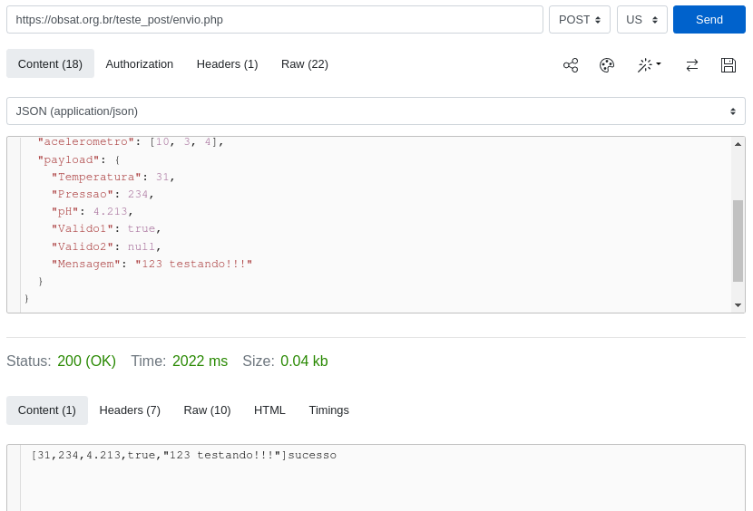

<h1 align="center" style="color:white; background-color:black">Telemetria OBSat-MCTI</h1>
<h4 align="center">Web Server para testes de telemetria da OBSat</h4>

<p align="center">
	<a href="http://zenith.eesc.usp.br/">
    
    </a>
    <a href="https://eesc.usp.br/">
    
    </a>
    <a href="https://github.com/zenitheesc/Telemetria-OBSat-MCTI/blob/main/LICENSE">
    
    </a>
    <a href="https://github.com/zenitheesc/Telemetria-OBSat-MCTI/issues">
    
    </a>
    <a href="https://github.com/zenitheesc/Telemetria-OBSat-MCTI/commits/main">
    
    </a>
    <a href="https://github.com/zenitheesc/Telemetria-OBSat-MCTI/graphs/contributors">
    
    </a>
    <a href="https://github.com/zenitheesc/Telemetria-OBSat-MCTI/commits/main">
    
    </a>
    <a href="https://github.com/zenitheesc/Telemetria-OBSat-MCTI/issues">
    
    </a>
    <a href="https://github.com/zenitheesc/Telemetria-OBSat-MCTI/pulls">
    
    </a>
</p>

### Objetivo

Este repositório serve para que você possa usar um microcontrolador externo ao seu satélite (ESP32) para simular o servidor embarcado na sonda e verificar se a implementação da sua telemetria esta correta.

### Funcionamento

Depois de carregar o programa na sua ESP32, deixe ela conectada ao USB do seu computador com um monitor serial ligado, ela vai criar uma rede wi-fi para que o seu satélite se conecte e envie os pacotes de telemetria, se a sua implementação estiver funcionando você poderá ver no monitor serial que o seu satélite se conectou e os pacotes enviados por ele.

#### Objservações

- Tenha atenção aos requisitos da telemetria definidos no edital da 2ª OBSat-MCTI
- O servidor não formata jsons, certifique-se de enviar JSONs formatados

### Formatação JSON e validação
#### Passo 1:
 Verificar se o JSON é valido, sites de analise de json como [este](https://jsonformatter.org/json-viewer) verificam se a estrutura é valida.
#### Passo 2:
 Tendo uma versão valida, use uma ferramenta de comunicação HTTP como [esta](https://reqbin.com/post-online) com a URL: https://obsat.org.br/teste_post/envio.php para validar especificidades.
##### Exemplo:


Para mais informações sobre os status de validação, veja a sessão `Deu erro, e agora?` neste [link](https://github.com/OBSAT-MCTI/OBSAT-MCTI/tree/main/servidor_testes).

### Utilização do servidor de teste
Para testar a interação com o servidor embarcado da Sonda e os modulos programados no BIPES, é necessario ter uma ESP32 que irá agir como servidor como esquematizado na imagem

<p>
  
<p/>

Para instalação do firmware na IDE do Arduino, certifique-se que a biblioteca ESP32 esteja instalada (clique no [link](https://www.youtube.com/watch?v=Ozr1SXwir9g) caso não saiba como instalar). Selecione a placa desejada e  carregue o codigo `obsat-server.ino`.

Para fazer testes pelo BIPES, [aqui](https://bipes.net.br/ide/?lang=pt-br#btyyen) um exemplo de implementaçao, basta estar na rede do servidor e deteminar `http://192.168.4.1/` para HTTP POST Request. Com isso você poderá fazer o seu satélite se comunicar com o servidor, simulando a operação na sonda.

Os parametros do ponto de acesso do Wi-Fi são:
- SSID: `obsat-test-server`
- PSK: `obsatpass`

### Exemplo de transmissão
```
{
  "equipe": 41,
  "bateria": 24,
  "temperatura": 30,
  "pressao": 1,
  "giroscopio": [42, 90, 30],
  "acelerometro": [10, 3, 4],
  "payload": {
    "sensor_status": "work work work",
    "temperature": 22.8,
    "humidity": 47.5,
    "gyroscope": {
      "x": 1,
      "y": 2,
      "z": 3
    },
    "accelerometer": {
      "x": 0.98,
      "y": 0.05,
      "z": 9.72
    },
    "motion_detected": true
  }
}

```
A transmissão deste JSON resultará na resposta abaixo

```
[STRING: work work work][FLOAT: 22.800][FLOAT: 47.500][INT: 1][INT: 2][INT: 3][FLOAT: 0.980][FLOAT: 0.050][FLOAT: 9.720][BOOL: true](68/90)
```

### F.A.Q.

Caso tenha algum problema com a utilização do servidor verifique a aba "Issues" do repositório, se ninguem tiver relatado o mesmo problema que o seu, abra um novo issue descrevendo o problema, assim que possível algum membro do Zenith irá te ajudar a resolver.

---
<p align="center">
    <a href="http://zenith.eesc.usp.br">
    
    </a> 
    <a href="https://www.facebook.com/zenitheesc">
    
    </a> 
    <a href="https://www.instagram.com/zenith_eesc/">
    
    </a>

</p>
<p align = "center">
<a href="zenith@usp.br">zenith@usp.br</a>
</p>
